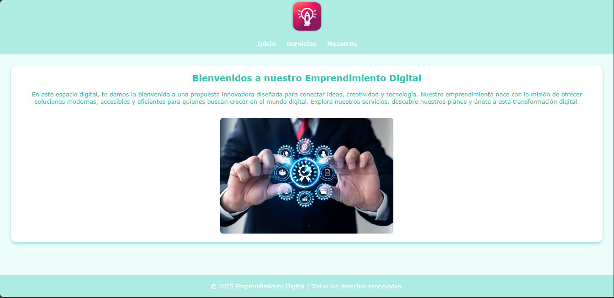
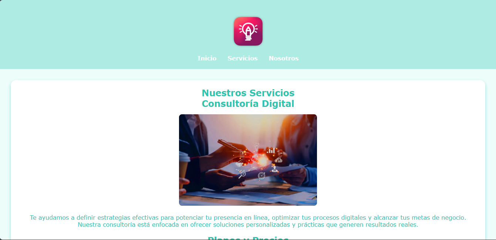
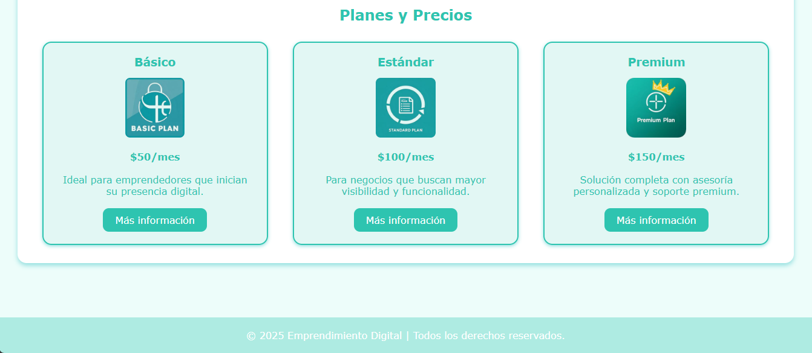
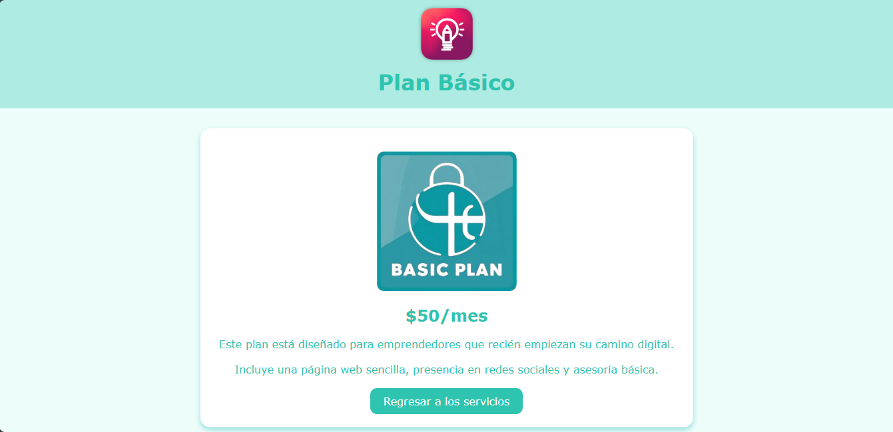
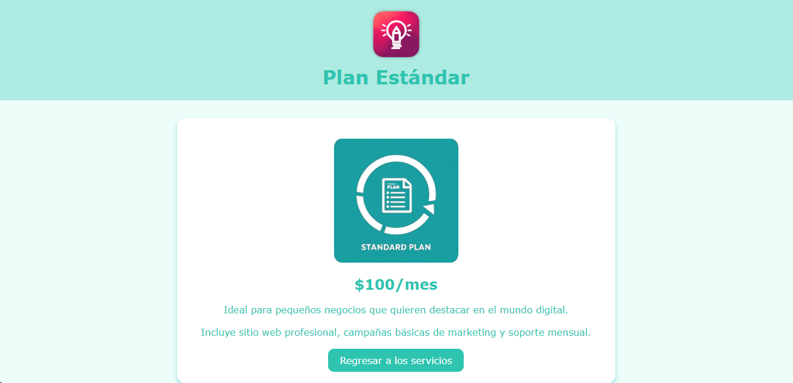
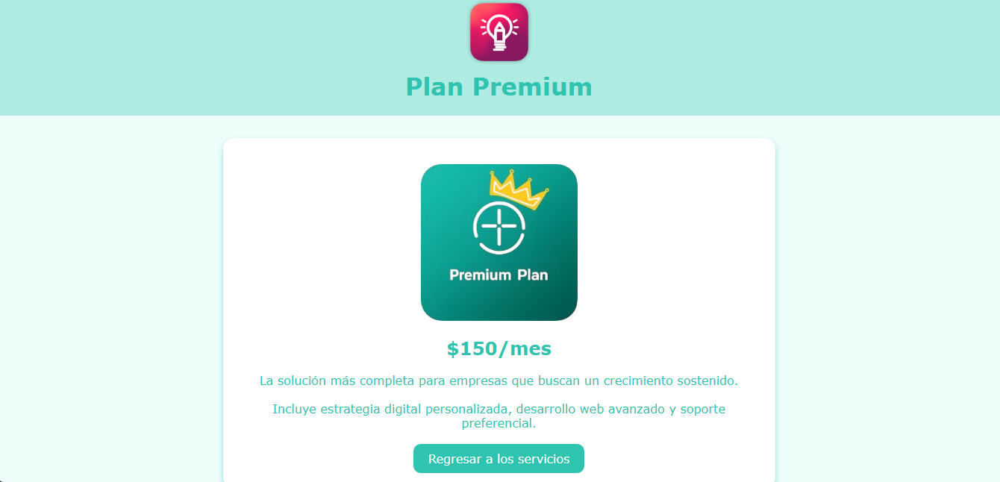
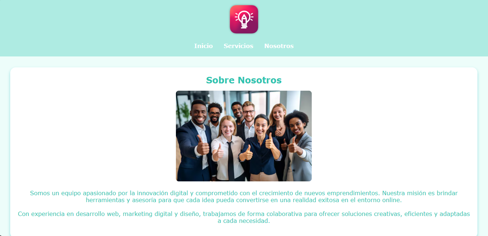

# Emprendimiento Digital

Sitio web desarrollado como parte de un taller práctico de HTML y CSS. Este proyecto simula la página de un emprendimiento digital que ofrece servicios y planes de suscripción. El objetivo es aplicar estructuras semánticas en HTML, diseño con CSS, y una organización coherente de archivos para lograr un sitio atractivo, responsivo y funcional.

El sitio incluye una página principal, una sección de servicios, detalle de planes, información sobre la empresa, y enlaces de navegación. Además, incorpora estilos personalizados, botones interactivos y estructura modular con carpetas organizadas.

## Comenzando 🚀

Esta práctica muesta como aplicar estilos CSS a un sitio web construido con HTML.

## Estructura del proyecto 📁

```txt
emprendimiento-digital/
├── css/
│   └── estilos.css
├── img/
│   └── (imágenes del sitio)
├── pages/
│   ├── plan_basico.html
│   ├── plan_estandar.html
│   └── plan_premium.html
├── index.html
├── servicios.html
├── nosotros.html
└── README.md
```

### Pre-requisitos 📋

* Servidor Web


## Características implementadas ✨

- Estructura semántica HTML5.
- Diseño responsivo con Flexbox.
- Estilos personalizados en CSS (colores, botones, tipografía).
- Navegación entre páginas con enlaces internos.
- Uso de tarjetas para mostrar servicios y planes.
- Botones con efecto hover.
- Footer fijo y estilizado.
- Preparación para despliegue en servidor local o GitHub Pages.

## Capturas de pantalla 🖼️ *(opcional)*

### Página de inicio



### Página de servicios




### Detalle del Plan Básico



### Detalle del Plan Estándar 



### Detalle del Plan Premium



### Página de Nosotros



## Instrucciones para clonar y visualizar el proyecto 🛠️

1. Clona el repositorio en tu equipo:

git clone git@github.com:cristo-web/emprendimiento-digital.git

2. Abre la carpeta en tu editor de código o navegador de archivos.

3. Haz doble clic en index.html o ábrelo desde el navegador para visualizar el sitio.

## Construido con 🛠️

* [Visual Studio Code](https://code.visualstudio.com/) - Editor de código fuente
* [Git](https://git-scm.com/downloads/win) - Git Bash para windows

## Autores ✒️


* **Cristopher Ordoñez** - *Trabajo Inicial* - [cristo-web](https://github.com/cristo-web)


## Licencia 📄

Este proyecto está bajo la Licencia (Tu Licencia) - mira el archivo [LICENSE.md](LICENSE.md) para detalles


---
⌨️ con ❤️ por [cristo-web](https://github.com/cristo-web) 😊